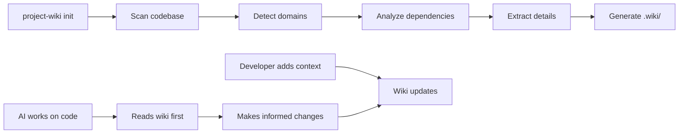

# project-wiki

**Your codebase has knowledge that only exists in people's heads. This tool extracts it, structures it, and keeps it alive.**

[](https://github.com/agencedebord/project-wiki/actions/workflows/ci.yml)
[](LICENSE-MIT)
[](https://www.rust-lang.org)

---

## Why this exists

Every project accumulates invisible knowledge: why deduplication is disabled, why that endpoint returns 200 instead of 201, why the billing module talks to the notification service. This knowledge lives in Notion tickets, Slack threads, PR comments, and the memories of people who might leave.

When an AI assistant -- or a new developer -- works on the codebase without this context, they "fix" intentional behavior. They undo decisions. They break things that looked broken but weren't.

**project-wiki** creates a `.wiki/` folder in your repo that serves as a persistent, versioned knowledge base. It scans your code to bootstrap the wiki, then stays in sync as the project evolves.

```
Before                              After

Notion  ----?                       .wiki/
Slack   ----?---> Developer         domains/
Code    ----?     (or AI)             import/_overview.md
Memory  ----?                         billing/_overview.md
                                    decisions/
No single source                      no-dedup-on-import.md
of truth                            _index.md
                                    _graph.md

                                    Everything in one place,
                                    versioned with the code.
```

## What it looks like

After running `project-wiki init`, your repo gets a `.wiki/` directory:

```
your-project/
  .wiki/
    _index.md            # Living table of contents
    _index.json          # Machine-readable index (for LLMs)
    _graph.md            # Mermaid dependency graph
    _needs-review.md     # Open questions after scan
    config.toml          # Wiki settings
    domains/
      import/
        _overview.md     # Domain summary with confidence levels
        csv-parsing.md   # Detailed notes on sub-topics
      users/
        _overview.md
      billing/
        _overview.md
    decisions/
      2026-03-26-no-dedup-on-import.md
```

Each note has a YAML front matter with a **confidence level** -- so you always know what to trust:

```markdown
---
domain: import
confidence: confirmed
last_updated: "2026-03-26"
related_files:
  - src/services/import/processor.rs
deprecated: false
---

# Import

## Key behaviors
- CSV files may contain empty rows -- this is expected [confirmed]
- Duplicate entity names are allowed (client has homonyms) [confirmed]
- Import triggers a notification on completion [seen-in-code]

## Business rules
- No deduplication by name -- see decisions/no-dedup-on-import.md [confirmed]

## Dependencies
- [Users](../users/_overview.md) -- import creates user records
- [Billing](../billing/_overview.md) -- triggers invoice generation
```

## How it works



The scanner runs three passes on your codebase:

| Pass | What it does | Output |
|------|-------------|--------|
| **Structure** | Scans directories, detects modules, services, routes | Domain list |
| **Relations** | Analyzes cross-module imports, builds dependency graph | `_graph.md` |
| **Details** | Reads models, endpoints, TODOs, tests, env vars | Domain notes |

Supports **JavaScript/TypeScript**, **Python**, **Rust**, and **Go** projects out of the box.

## Confidence system

Not all knowledge is equal. Every piece of information in the wiki carries a confidence tag:

| Level | Source | Trust it? |
|-------|--------|-----------|
| `confirmed` | Validated by a human | Yes -- this is ground truth |
| `verified` | Cross-checked in code + docs | Yes |
| `seen-in-code` | Extracted from source code | Mostly -- verify if critical |
| `inferred` | Deduced from structure | Maybe -- check before relying on it |
| `needs-validation` | Uncertain or outdated | No -- verify first |

The golden rule: **if the wiki contradicts the code, the code wins.** Update the wiki.

## Quick start

```bash
# Install
cargo install project-wiki

# Initialize (scans your codebase automatically)
cd your-project
project-wiki init

# See what was found
project-wiki status
project-wiki consult --all
project-wiki graph
```

That's it. The wiki is populated, committed with your code, and ready to use.

## Commands

### Read

```bash
project-wiki consult [domain]    # Read notes for a domain (or --all)
project-wiki search <term>       # Full-text search across all notes
project-wiki graph               # Display the Mermaid dependency graph
project-wiki status              # Wiki health: coverage, staleness, confidence
```

### Write

```bash
project-wiki add domain <name>           # Create a new domain
project-wiki add context "<text>"        # Add knowledge (auto-routed to domain)
project-wiki add decision "<text>"       # Record a business decision
project-wiki confirm <target>            # Promote confidence to confirmed
project-wiki deprecate <target>          # Mark as deprecated
project-wiki rename-domain <old> <new>   # Rename + update all references
project-wiki import <folder> <domain>    # Import external markdown files
```

### Maintain

```bash
project-wiki validate            # Check for broken links, dead refs, staleness
project-wiki rebuild             # Regenerate graph + index from scratch
project-wiki index               # Regenerate _index.md and _index.json
```

## Claude Code integration

`project-wiki init` automatically patches your `.claude/CLAUDE.md` with instructions that tell Claude Code to:

1. **Read** the wiki before each non-trivial task
2. **Respect** documented business decisions
3. **Update** wiki notes after modifying behavior
4. **Commit** wiki changes separately with a `wiki:` prefix

This turns the wiki into a feedback loop: the more the team uses it, the smarter the AI becomes about the project.

## Optional: Notion import

Pull knowledge from your Notion boards directly:

```bash
# Install with Notion support
cargo install project-wiki --features notion

# Import from a Notion database
project-wiki init --from-notion <database-url>

# Resume an interrupted import
project-wiki init --from-notion <database-url> --resume
```

The importer handles batch pagination (1000+ tickets), detects contradictions between tickets, and cross-references everything with what it found in the code.

## Configuration

`.wiki/config.toml`:

```toml
# Days before a note is considered stale (default: 30)
staleness_days = 30

# Auto-regenerate _index.json after mutations (default: true)
auto_index = true
```

## Installation

### From source

```bash
git clone https://github.com/agencedebord/project-wiki.git
cd project-wiki
cargo build --release
# Binary: target/release/project-wiki (1.7 MB)
```

### npm (coming soon)

```bash
npx project-wiki init
```

Requires Rust 1.85.0+. Release binary is optimized for size (LTO, single codegen unit, symbol stripping).

## Contributing

Contributions are welcome. See [CONTRIBUTING.md](CONTRIBUTING.md) for setup and guidelines.

## License

Licensed under either of [Apache License 2.0](LICENSE-APACHE) or [MIT License](LICENSE-MIT), at your option.
